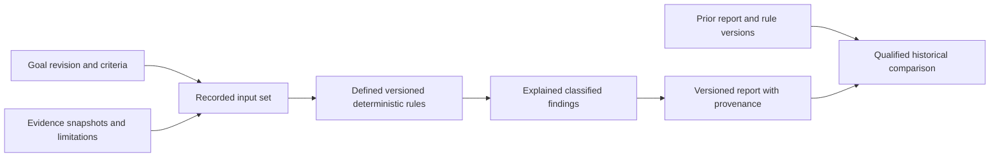

# Reproducible assessment flow

```mermaid
flowchart LR
  Goal[Goal revision and criteria] --> Inputs[Recorded input set]
  Snapshots[Evidence snapshots and limitations] --> Inputs
  Inputs --> Rules[Defined versioned deterministic rules]
  Rules --> Findings[Explained classified findings]
  Findings --> Report[Versioned report with provenance]
  Previous[Prior report and rule versions] --> Compare[Qualified historical comparison]
  Report --> Compare
```