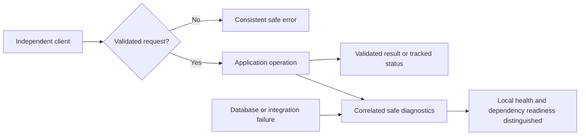

# API operation outcomes

```mermaid
flowchart LR
  Client[Independent client] --> Validate{Validated request?}
  Validate -->|No| Error[Consistent safe error]
  Validate -->|Yes| Operation[Application operation]
  Operation --> Result[Validated result or tracked status]
  Operation --> Diagnostic[Correlated safe diagnostics]
  Dependency[Database or integration failure] --> Diagnostic
  Diagnostic --> Qualified[Local health and dependency readiness distinguished]
```