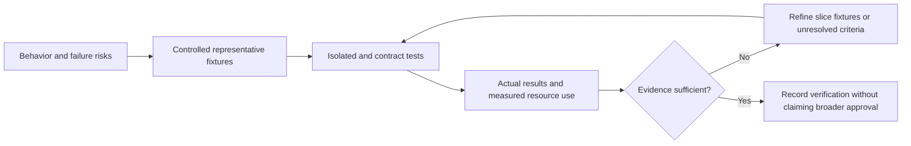

# Evidence-producing quality loop

```mermaid
flowchart LR
  Risk[Behavior and failure risks] --> Fixtures[Controlled representative fixtures]
  Fixtures --> Tests[Isolated and contract tests]
  Tests --> Results[Actual results and measured resource use]
  Results --> Review{Evidence sufficient?}
  Review -->|No| Revise[Refine slice fixtures or unresolved criteria]
  Revise --> Tests
  Review -->|Yes| Record[Record verification without claiming broader approval]
```