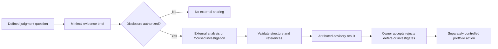

# Authorized advisory handoff

```mermaid
flowchart LR
  Question[Defined judgment question] --> Brief[Minimal evidence brief]
  Brief --> Authorization{Disclosure authorized?}
  Authorization -->|No| Stop[No external sharing]
  Authorization -->|Yes| External[External analysis or focused investigation]
  External --> Validate[Validate structure and references]
  Validate --> Advice[Attributed advisory result]
  Advice --> Review[Owner accepts rejects defers or investigates]
  Review --> Separate[Separately controlled portfolio action]
```