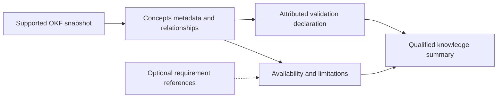

# Independent knowledge availability

```mermaid
flowchart LR
  OKF[Supported OKF snapshot] --> Inventory[Concepts metadata and relationships]
  Inventory --> Availability[Availability and limitations]
  Requirements[Optional requirement references] -.-> Availability
  Availability --> Report[Qualified knowledge summary]
  Inventory --> Validation[Attributed validation declaration]
  Validation --> Report
```