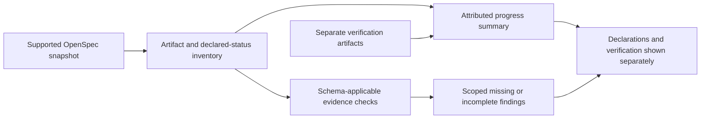

# Declared progress without false verification

```mermaid
flowchart LR
  Snapshot[Supported OpenSpec snapshot] --> Inventory[Artifact and declared-status inventory]
  Inventory --> Summary[Attributed progress summary]
  Inventory --> Check[Schema-applicable evidence checks]
  Check --> Findings[Scoped missing or incomplete findings]
  Verification[Separate verification artifacts] --> Summary
  Summary --> Report[Declarations and verification shown separately]
  Findings --> Report
```