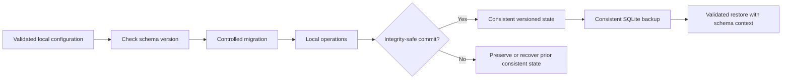

# Consistency and recovery flow

```mermaid
flowchart LR
  Config[Validated local configuration] --> Version[Check schema version]
  Version --> Migration[Controlled migration]
  Migration --> Service[Local operations]
  Service --> Transaction{Integrity-safe commit?}
  Transaction -->|Yes| History[Consistent versioned state]
  Transaction -->|No| Prior[Preserve or recover prior consistent state]
  History --> Backup[Consistent SQLite backup]
  Backup --> Restore[Validated restore with schema context]
```