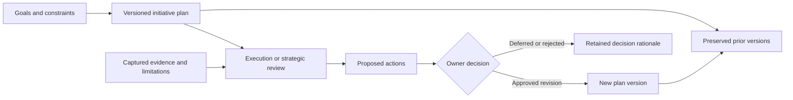

# Versioned planning flow

```mermaid
flowchart LR
  Goals[Goals and constraints] --> Plan[Versioned initiative plan]
  Plan --> Review[Execution or strategic review]
  Evidence[Captured evidence and limitations] --> Review
  Review --> Advice[Proposed actions]
  Advice --> Decision{Owner decision}
  Decision -->|Approved revision| Next[New plan version]
  Decision -->|Deferred or rejected| Record[Retained decision rationale]
  Plan --> History[Preserved prior versions]
  Next --> History
```