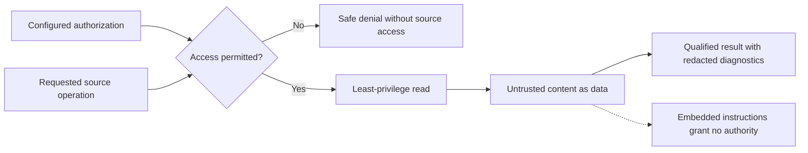

# Authority does not come from source content

```mermaid
flowchart LR
  Config[Configured authorization] --> Gate{Access permitted?}
  Request[Requested source operation] --> Gate
  Gate -->|No| Deny[Safe denial without source access]
  Gate -->|Yes| Read[Least-privilege read]
  Read --> Data[Untrusted content as data]
  Data --> Report[Qualified result with redacted diagnostics]
  Data -.-> Ignore[Embedded instructions grant no authority]
```