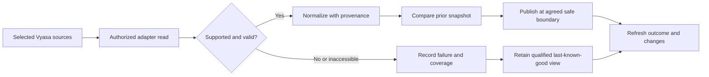

# Refresh outcome flow

```mermaid
flowchart LR
  Scope[Selected Vyasa sources] --> Read[Authorized adapter read]
  Read --> Format{Supported and valid?}
  Format -->|Yes| Normalize[Normalize with provenance]
  Normalize --> Compare[Compare prior snapshot]
  Compare --> Publish[Publish at agreed safe boundary]
  Format -->|No or inaccessible| Failure[Record failure and coverage]
  Failure --> Prior[Retain qualified last-known-good view]
  Publish --> Outcome[Refresh outcome and changes]
  Prior --> Outcome
```